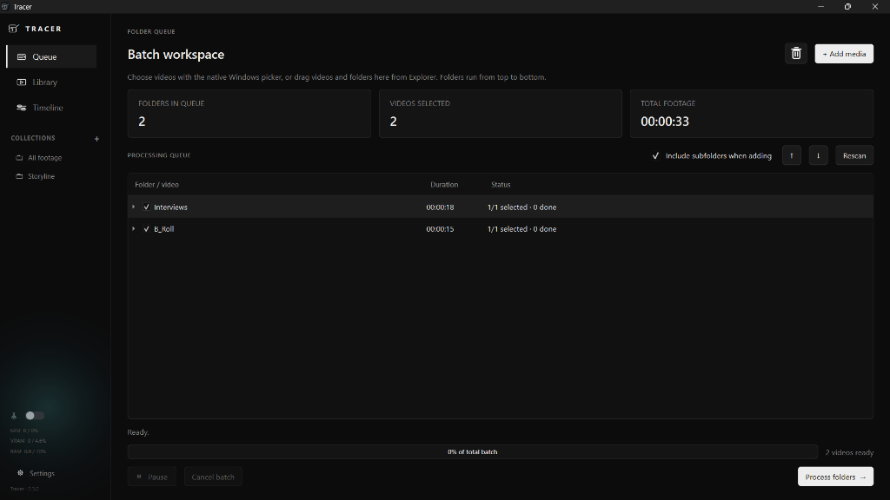
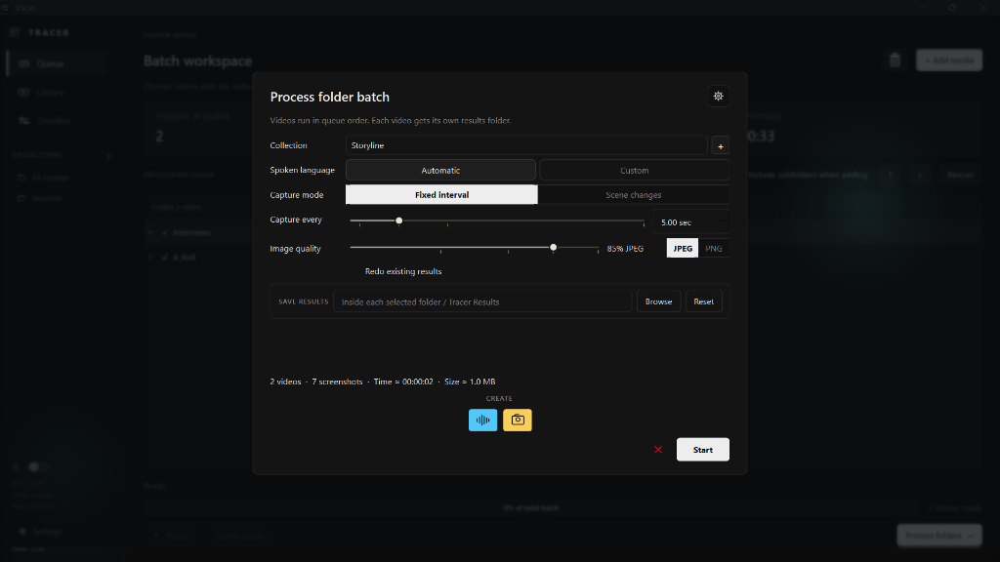
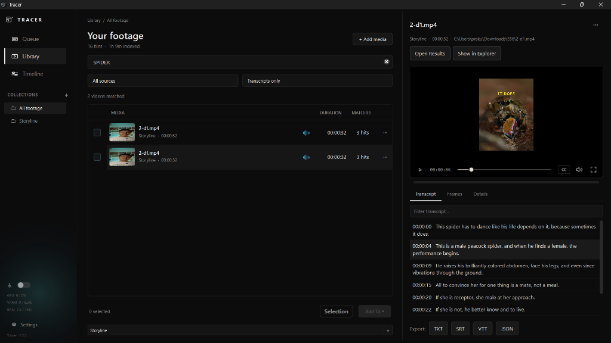
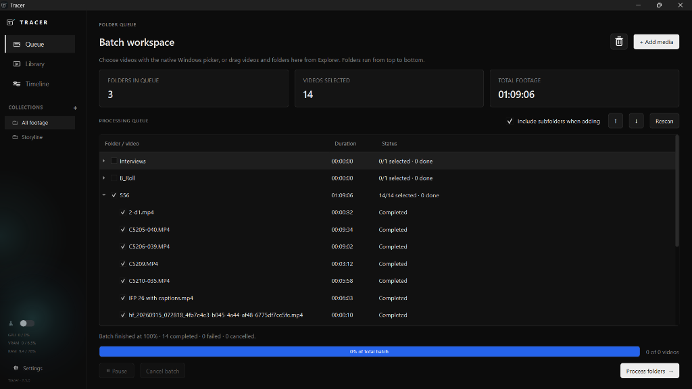
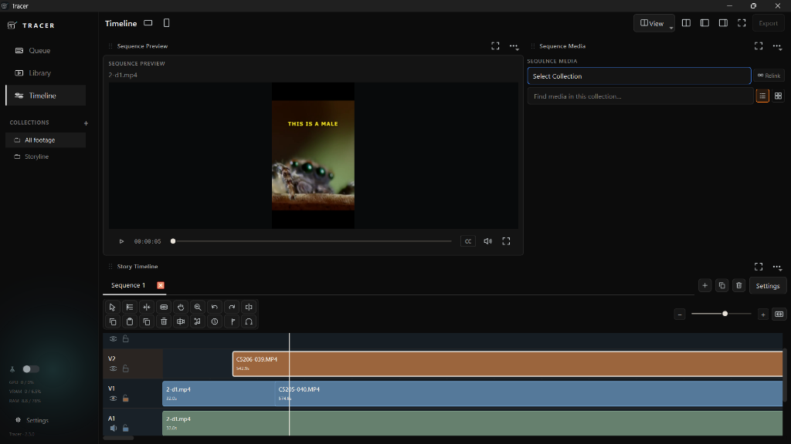

# Tracer

[⬇️ Download Windows Installation Here](https://drive.google.com/file/d/1B--kW_eXuNG1ebMtJTupDBM0UeckGG46/view?usp=sharing)

Built by **Nimbus**.

**Find the moment you need without opening every file.**

Tracer is a video organisation tool built for projects where the footage pile has stopped being a folder and started becoming a lifestyle problem.

Import your videos, let Tracer transcribe them and generate screenshots, search across your footage using what was said, organise useful clips on a timeline, and export what you need.

> Built because going through hundreds of files isn't my favourite part of the day.

---

## Why I built this

Tracer actually started as part of another project.

I needed a way to prepare and organise datasets from large amounts of video.

Which mostly meant doing a lot of this:

**open → scrub → figure out what's inside → rename → move → repeat**

After doing that enough times, I realised this is also a very normal editing problem.

You often know exactly what you're looking for.

You remember the conversation.

You remember roughly what was happening.

You may even remember the exact sentence.

You just don't know whether it's inside:

`A001_C004.mp4`

`Interview_03.mp4`

or the industry-standard:

`final_final_USE_THIS_v7.mp4`

Tracer is my attempt to make that part less painful.

---

## What Tracer does

### Transcribe your footage

Tracer automatically generates transcripts for your videos, making the spoken content of an entire project searchable.

Search for something that was said and jump directly to the relevant moment.

No digital archaeology required.

### Jump to the exact moment

Search results are linked to timestamps in the source footage.

So instead of:

> "I swear they said it somewhere in one of these interviews."

you can actually find it.

### Generate screenshots

Tracer generates screenshots throughout your footage so you can scan clips visually without opening every single file.

Because filenames like `C0078.MP4` are not particularly strong visual descriptions.

### Browse everything in one library

Your videos, screenshots and transcripts live together inside one library.

Instead of bouncing between folders, media players and increasingly desperate Windows searches, you can see the project in one place.

### Sort footage on a timeline

Found useful material?

Add it to the timeline and start arranging, sorting and narrowing down your footage before moving into the main edit.

It's not trying to replace your editor.

Premiere can sleep peacefully tonight.

### Export what you need

Once you've found and organised the useful material, export it directly from Tracer.

The point is to get from:

**"I have 300 files."**

to:

**"These are the 17 I actually care about."**

as quickly as possible.

---

## Where this is going

The next step is making Tracer better at understanding the visual side of footage.

That means:

- better visual organisation
- visual indexing
- semantic search
- finding footage based on what's happening in the frame, not only what was said

Eventually, the goal is simple:

**You remember the shot. Tracer figures out where it is.**

---

## Current version

### Tracer v1

- [x] Video library
- [x] Automatic transcription
- [x] Transcript search
- [x] Timestamp-level results
- [x] Screenshot generation
- [x] Timeline-based sorting
- [x] Export workflow
- [ ] Semantic transcript search
- [ ] Visual indexing
- [ ] Visual search
- [ ] Better visual organisation

---

## Build notes

Tracer was designed and directed by me, with **AI-assisted coding throughout the development process**.

Coding collaborators:

- **Antigravity**
- **ChatGPT / GPT-5.6**
